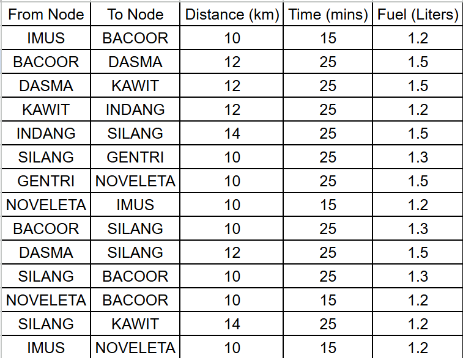

# MidtermLab2 – Cavite Network Node Map & Shortest Path Finder

## Overview
This program visualizes a network of locations in Cavite and finds the
shortest path between any two nodes based on **Distance**, **Time**, or
**Fuel** consumption using **Dijkstra's Algorithm**.

---

## Files
| File | Description |
|---|---|
| `MidtermLab2-Mangubat.py` | CLI-based Python program |
| `MidtermLab2-Mangubat.html` | Interactive browser-based visualization |
| `README.md` | This file |

---

## Nodes in the Network
IMUS, BACOOR, DASMA, KAWIT, INDANG, SILANG, GENTRI, NOVELETA


---

## Algorithm Used – Dijkstra's Algorithm

Dijkstra's algorithm finds the shortest path from a source node to a
destination node in a weighted graph by:

1. Starting at the source with cost 0.
2. Using a **min-heap (priority queue)** to always expand the lowest-cost
   unvisited node.
3. Relaxing all neighbors – if a cheaper route to a neighbor is found,
   it replaces the old route.
4. Stopping once the destination node is popped from the heap.

**Time Complexity:** O((V + E) log V) where V = nodes, E = edges.

The graph is treated as **undirected** – every edge can be traversed in
both directions with the same cost.

---

## How to Run (Python CLI)

```bash
python MidtermLab2-Mangubat.py
```

Follow the prompts:
1. Enter a **start** node (e.g., `IMUS`)
2. Enter an **end** node (e.g., `SILANG`)
3. Choose criterion: `1` Distance · `2` Time · `3` Fuel

### Sample Output
```
Shortest Path (distance) from IMUS to SILANG:
  Path   : IMUS → BACOOR → SILANG
  Distance: 20 km
  Time    : 40 mins
  Fuel    : 2.5 Liters
```

---

## How to Run (Browser / HTML)

Open `MidtermLab2-Mangubat.html` in any modern browser.  
- The interactive **node map** is drawn with Canvas/SVG.  
- Select source, destination, and criterion, then click **Find Path**.  
- The shortest path is highlighted on the map with full stats.

- Or click this link: https://lliane03.github.io/DAALab-AY225-MANGUBAT/MIDTERM-LAB-2/MidtermLab2-Mangubat.html
---

## Challenges Faced

As a computer science student implementing Dijkstra's algorithm for a real-world network application, I encountered several technical and conceptual challenges that tested my understanding of graph theory, algorithm design, and software development:

1. **Graph Representation and Data Structures** – Choosing the right way to represent the Cavite network was crucial. I initially struggled with adjacency lists vs. matrices, and had to implement a custom graph class that could handle multiple edge weights (distance, time, fuel) efficiently. The challenge was ensuring the data structure scaled well while remaining easy to modify for different routing criteria.

2. **Graph Directionality and Realism** – The original network data provided directed edges, but real-world road networks are typically undirected. I had to implement both directed and undirected modes, with a toggle in the HTML version. This required careful consideration of how to handle bidirectional travel while maintaining accurate cost calculations for each direction.

3. **Multi-Criteria Optimization with Dijkstra's Algorithm** – Dijkstra's algorithm is designed for single-weight optimization, but this project required optimizing for three different criteria (distance, time, fuel). I solved this by dynamically rebuilding the priority queue keys when switching criteria, but this introduced complexity in maintaining algorithm correctness and efficiency. Understanding how to adapt a single-criterion algorithm for multi-criterion problems was a significant learning curve.

4. **Priority Queue Implementation and Performance** – Implementing a proper min-heap (priority queue) in Python was challenging, especially ensuring it handled the custom comparison logic for different criteria. I had to balance between using Python's heapq module and implementing a custom solution that could handle tie-breaking consistently.

5. **Tie-Breaking and Deterministic Results** – When multiple paths have equal cost, Dijkstra's algorithm doesn't guarantee which path will be chosen. I implemented secondary sorting by node name to ensure reproducible results, but this required deep understanding of how the priority queue orders elements and how to implement stable sorting in the algorithm.

6. **HTML Canvas Visualization** – Creating an interactive node map using HTML5 Canvas was new territory. Positioning nodes accurately, drawing edges with proper curvature, and implementing click interactions required learning Canvas API fundamentals. Animating the path highlighting and displaying real-time statistics added another layer of complexity to the web interface.

7. **Data Validation and Error Handling** – Ensuring the program handled invalid inputs (non-existent nodes, disconnected graphs) gracefully was important for a robust application. I had to implement comprehensive input validation and provide meaningful error messages to users.

8. **Balancing CLI and GUI Implementations** – Maintaining feature parity between the Python CLI version and HTML web version required careful planning. Each platform had different constraints and capabilities, forcing me to think about cross-platform compatibility and user experience design.

9. **Algorithm Time Complexity Understanding** – While implementing O((V + E) log V) complexity theoretically, seeing it in practice with different graph sizes helped solidify my understanding of algorithmic analysis. The dramatic performance differences when scaling from small to larger networks was eye-opening.

10. **Integration of Multiple Technologies** – Combining Python for backend logic, HTML/CSS/JavaScript for frontend visualization, and understanding how to structure a project with multiple deliverables (CLI script, web app, documentation) required learning project organization and version control best practices.

These challenges helped me grow significantly as a developer, from theoretical algorithm knowledge to practical implementation skills, and from console programming to interactive web applications.

---

## Contact

For questions or feedback regarding this project:
- **Email**: angeljullianemangubat@gmail.com
- **GitHub**: Lliane03
